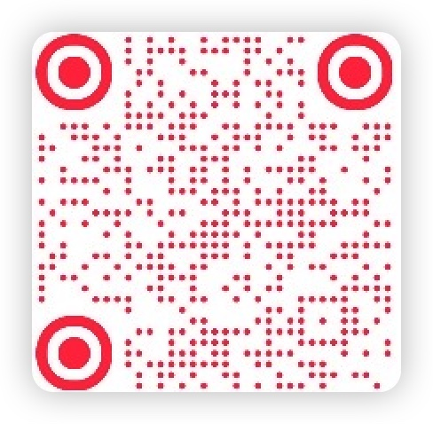

# 📖 Read Novel Vocab Engine (看小说背单词引擎)
### A demo of “Learn English by Reading Stories”
（通过阅读故事学英语｜看小说背单词引擎）

> **沉浸式英语学习框架：通过阅读故事，结合艾宾浩斯遗忘曲线，轻松掌握核心词汇。**

## 📝 项目简介

这是一个纯前端的英语学习引擎演示。项目展示了如何利用现代前端技术（Vite + Vanilla JS + LocalStorage）构建一个无后端依赖的轻量级学习应用。

当前仓库为**核心引擎开源版**，内置了 10 篇精选 Demo 故事，用于演示复习算法与交互逻辑。

## ✨ 核心特性

- **📚 沉浸式阅读**：Step 1-4 完整学习流程（阅读 -> 选词 -> 填空 -> 复习）。
- **🧠 间隔重复 (SRS)**：内置基于艾宾浩斯遗忘曲线的复习算法，科学抗遗忘。
- **⚡️ 纯前端架构**：基于 Vite 构建，无后端依赖，极速部署。
- **🔒 数据隐私**：所有学习进度、生词本均存储在本地 `localStorage`，用户数据完全私有。
- **🛡️ 代码保护**：生产环境构建自动集成 `Terser` 混淆，保护核心业务逻辑。

## 🚀 获取完整版 (Full Version)

本仓库主要演示核心引擎功能。

**正在寻找完整版体验？**
正式产品会拥有精心编写的 **50 篇连载故事**，覆盖 **4000+** 核心考研/GRE 词汇，提供更完整的进阶学习体验。

👉 **在线体验完整版：** [https://wordnovelwebdemo.click](https://wordnovelwebdemo.click)

👉 **关注开发者小红书：** **@kylin的小世界** (获取最新动态及完整数据包)

<br>

<div align="center">
    
</div>

## 🛠️ 技术栈

- **Build Tool**: `Vite 7`
- **Core**: Native JavaScript (Vanilla JS)
- **Storage**: Browser LocalStorage
- **Optimization**: Terser (Code Obfuscation & Minification)
- **Styling**: CSS Variables

## 💻 快速开始

在终端中运行以下命令即可启动项目：

```bash
# 1. 安装依赖
npm install

# 2. 启动本地开发服务器
npm run dev
常用命令：

npm run dev：启动本地开发环境（支持热更新）。

npm run build:demo：构建生产版本（自动生成 Demo 数据并混淆代码）。

npm run preview：预览构建后的生产环境代码。

📂 项目结构
Plaintext

read-novel-vocab-engine/
├── public/
│   ├── data_demo.json       # 演示数据（10篇故事）
│   └── xhs_qr.png           # 引流二维码
├── src/
│   ├── js/
│   │   ├── DataManager.js   # 数据加载与管理
│   │   └── main.js          # 核心业务逻辑入口
├── *.html                   # 多页面入口 (index/story/words...)
├── vite.config.js           # Vite 配置
└── README.md                # 项目文档
⚠️ 注意事项
数据隔离：本项目仅包含 data_demo.json。完整版数据 data_full.json 属于私有资产，未包含在此仓库中。

代码混淆：为了保护知识产权，执行 npm run build:demo 后生成的 dist/ 目录中，核心逻辑代码会被混淆。

📄 版权与许可
本项目代码部分遵循开源协议，内容数据（故事文本）仅供演示使用。

如需商业合作或获取完整内容授权，请通过小红书联系本项目开发者：@kylin的小世界

© 2025 @kylin的小世界. All Rights Reserved.

❤️ 支持开发者
如果你觉得这个项目对你有启发，或者单纯想请我喝杯咖啡（以此加速完整版小程序的开发），欢迎打赏！

<details> <summary><strong>👉 点击展开赞助二维码 (WeChat / Alipay)</strong></summary>

<div align="center">   <p><sub>感谢您的支持！所有赞助将用于后续的服务器维护和我的秃头治疗费 💇🏻‍♀️</sub></p> </div>

</details>